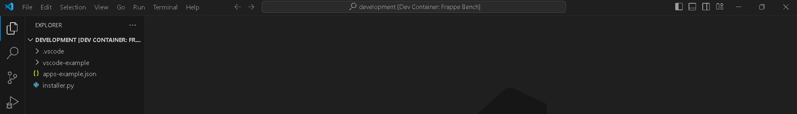
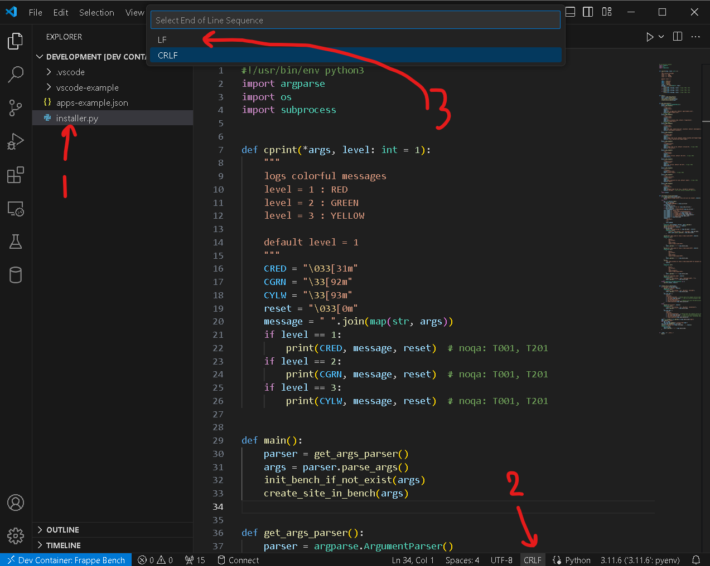

# ERPNext-Docker-Installtion-Guide
A Guide for Installing Frappe &amp; erpNext on Docker

## Prequsites:
- docker
- vscode
- docker-compose
- user added to docker group
- Install Dev Containers for VSCode 
- wsl (windows subsystem for linux)

## Steps:

### Step 1: Clone and change directory to frappe_docker directory
Use commands: 
```shell
git clone https://github.com/frappe/frappe_docker.git zatca-dev
cd zatca-dev
```

### Step 2: Copy example devcontainer config from `devcontainer-example` to `.devcontainer`

```shell
cp -R devcontainer-example .devcontainer
```

### Step 3: Copy example vscode config for devcontainer from `development/vscode-example` to `development/.vscode`. This will setup basic configuration for debugging.

```shell
cp -R development/vscode-example development/.vscode
```

### Step 4: Open frappe_docker folder in VS Code.

```shell
code .
```

### Step 5:  `Dev Containers: Reopen in Container`. 

- Launch the command, from Command Palette (Ctrl + Shift + P) `Dev Containers: Reopen in Container`. You can also click in the bottom left corner to access the remote container menu.

- wait for its loading

#### expect to see the container in vscode like the following:


### step 6: Make sure files `installer.py` and `apps-example.json` are set to LF Not CRLF

- 1 open the file
- 2 click on `CRLF`below 
- 3 Select LF from the upper window
- 4 save the file
- 5 repeat steps with `apps-example.json`

### Step 7: inside vscode open a new terminal in the container `Terminal Menu -> New Terminal`

### Step 8: run installer.py

- inside the terminal run:
 ```shell
python installer.py
```
- Don't close the terminal - wait for frappe and erpnext installation finish. -it may take a lot of time

### Step 8: Start Bench
- run commands:
 ```shell
cd frappe-bench
bench start
```
- Test frappe and erpnext
    - open `development.localhost:8000` in browser
    - use credintials: `Administrator` : `admin` to login
    - complete installation of frappe
        - Time Zone : `Asia/Riyadh`
        - Currency  : `SAR`
    - click next
    - company name : `Appy Innovate`
    - click `complete setup`
## Congratulations! Now You have your erpnext on Docker
